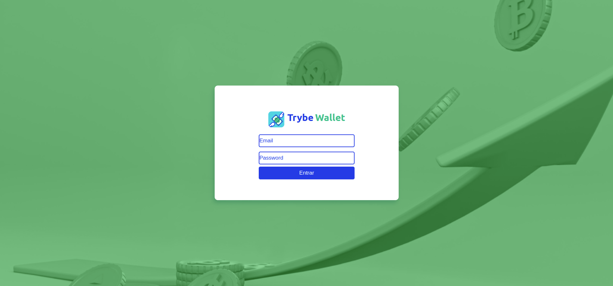
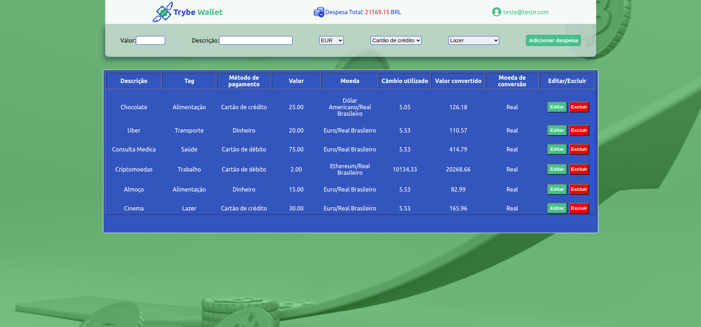
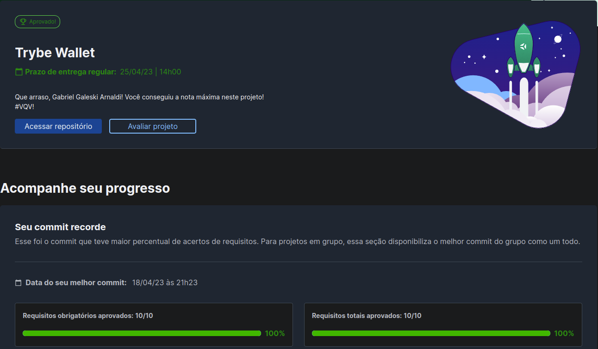

# :money_with_wings: Trybe Wallet! :money_with_wings:

 

# :camera_flash: Imagens do Projeto

  
<strong>Imagens</strong>
 
  
  
  

 

# :clipboard: About
Projeto Desenvolvido durante o curso da Trybe com foco na utilização do Redux e do Redux thank. Nele Foi criado Uma aplicação com react para registro de gastos estrangeiros, fazendo a conversao para o Real no momento do cambio atual, utilizando API, que muda conforme o cambio muda, e gerando uma tabela de gastos onde é possivel editar, excluir e adicionar mais gastos.

 

# :hammer_and_wrench: Skills & Tools

- HTML5
- CSS3
- JavaScript ES6+
- React.js
- React Testing Library
- Jest
- Redux
- Redux thunk

 

# :scroll: Nota

 
 
# :construction: To Implement :construction:

- Adicionar icons nos botoes (CSS)
- Ajustar a tabela e background (CSS)
- Mobile (CSS)
- Mudança nos inputs apos o click para editar (JS)
